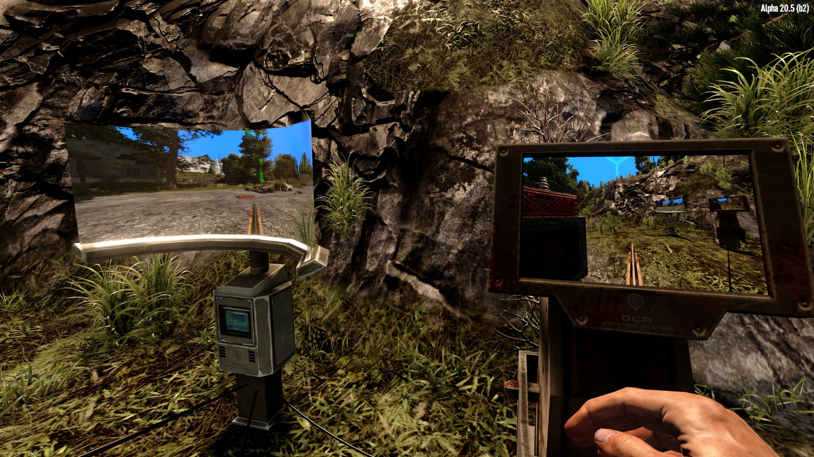

# OCB Remote Turret Control Mod - 7 Days to Die (V1.0) Addon

Introduces a new control panel block that connects with powered turrets.
Once the control panel is opened, you can switch between turrets.
Additionally the control block also broadcasts the video signal.
You can also open the zoom view for the turret which allows you
to fully take control over that turret (and yes, shooting too).
Last but not least, you can fill ammunition remotely, but only
if you have the required perks unlocked (read below).

[![GitHub CI Compile Status][4]][3]

[3]: https://github.com/OCB7D2D/OcbRemoteTurretControl/actions/workflows/ci.yml
[4]: https://github.com/OCB7D2D/OcbRemoteTurretControl/actions/workflows/ci.yml/badge.svg

## Basic function and usage

A control panel will automatically detect connected turrets, but only
up to a certain level deep, currently max. 5 nodes away from the panel.
It doesn't matter how long your cable-connections are, only the number
of interconnections between a turret and the control panel matter.

Note: This limit was deliberately chosen, since it should guarantee
that all turrets are actually loaded and active in the world. If we
see that it causes issues, we might reduce it accordingly.

### Basic Block Setup

1) Place a Power Source
2) Place a Control Panel
3) Place a Powered Turret
4) Connect source with panel
5) Connect panel with turret
6) Interact with the panel :)

### Interacting with the Panel

You can interact with the panel by pressing `E` (may vary). If a turret
is connected, it will open the regular turret window. The magic part is
that you can press `A` and `D` to switch between all connected turrets.

Note: The keys can be configured in the blocks XML config in case there
are any conflicts. It's there in case it's needed.

### Multi-Player support

While the mod has been crafted with multi-player support in mind, the
complexity of it make it likely that there are still a few serious bugs.
Although I tested it quite thoroughly before the first release, only
time can tell how well I anticipated the potential edge cases.

Note: When the control panel is opened, we only lock the panel first.
Then we try to acquire a lock to one of the connected turrets. If all
are locked (in use by others), the window will close right aways.
For clients this means a round-trip each time they switch turrets.

## Remote Turret CCTV

This feature is a happy accident, as I didn't initially plan for this
feature. But turned out to be relatively easy, so I decided to give it
a go. I was aware from the beginning that I would need to come up with
solutions for potential performance issues. And I think I came up with
something that should be solid and scalable (to the extend possible)

## Recipes and Perks

Hint: As with all of my mods, recipes and other things can always
change and I may not update the text in this readme as often.

Recipe to craft this block can be unlocked by `Turrets Skill Level 4`
or by finding the corresponding Schematics (with the rest of the
electrical schematics and t2 tools). The block is fairly expensive
to craft, specially considering it needs 2 robotic parts.

## Models and Credits

There are actually two fully functional models for this blocks.
Craft the variant helper block and use `R` to choose the variant.

Note: When you pickup the placed blocks, you will actually get
the variant helper block back and can place another variant.

1) Initial model is [`Futuristic Apocalypse Console by Bunny`][1], which
was nicely personalized and refurbished for me by Mumpfy.

2) Model was [purchased by Guppycur in Unity Asset Store ][2] and
Mumpfy pimped and personalized the textures for me again.

[1]: https://sketchfab.com/3d-models/5f13779baa6e43c6ae0bcd5bfe534c09
[2]: https://assetstore.unity.com/packages/3d/props/industrial/13104

Note: The two screensaver shaders are ported by me from various
sources at https://www.shadertoy.com/. There exist so many variations
of the same code there, it's impossible to make any clear attribution.

### Maintenance Perks

Trough the control panel you can also access the ammo slots of each
turret. I didn't want to just give this freely away to anyone that
has the block. In order to fill-up ammo you need `Boomstick Level 3`
and/or `Machine Gunner Level 3`. They will only unlock maintenance
for the specific ammo type related to the perk tree ;)

Note: The whole ammo vs perk system for maintenance can be configured
in the blocks XML config. This should even be flexible enough to
accommodate other powered turrets with different types of ammo.

## CCTV Performance

Implementing CCTV was rather simple, but I hesitated a little due to
performance concerns. Now I'm happy I tried it out as I think the
result more or less speaks for itself. Below are a bit more in-depth
information about how I achieved stable performance:

### Performance considerations

First I need to go a little into the details how this is achieved.
For every CCTV screen we need to render to whole scene a second time
from the viewpoint of that camera. It more or less means doing twice
the rendering work. Not completely true, since target resolution etc.
may also be lower for the second camera, but you get the picture.

Note: You can easily have hundred of cameras in a game, as long as they
don't render the scene each frame (that action is the expensive part).

### Performance optimizations

At the block level we manage a list of control panels:
- Blocks are remove/added as they are loaded/unloaded
- Ticks all blocks in a reasonable interval to:
  - Check if local player is in proximity to panel
  - Very cheap to do by (square) distance of 2 points
  - Triggers events when panel gets active/inactive

This loop can run at a very peaceful pace. We don't need perfect
reaction time here. Once a panel is close to the player, we start
broadcasting the camera to the screen. Drawing the screen is cheap,
but updating the underlying texture by letting the camera render the
scene from it's perspective, is very expensive. We could simply say
that each camera only renders on e.g. each fifth frame. This would
kinda work, but still can lead to unexpected jitters when lucks
says that all cameras agree on the exact same frame. 
We need something a bit more sophisticated!

### Secondary camera frame limiter

The basic issue is quite simple, we have a list of cameras that want
to render as often as possible but still play nicely if needed. So
instead of trying to limit each one on its own, we introduced
another manager. This one will make sure that basically only one
other render call is made per frame update.

Note: The implementation also supports priorities among all cameras,
which means that screens the player stands closer are updated more
frequently. When very close, up to same fps as the main game runs.
Further away you may only get an update each 1 or 2 seconds.

## Download and Install

End-Users are encouraged to download my mods from [NexusMods][5].  
Every download there helps me to buy stuff for mod development.

Otherwise please use one of the [official releases][6] here.  
Only clone or download the repo if you know what you do!

[5]: https://www.nexusmods.com/7daystodie/mods/2279
[6]: https://github.com/OCB7D2D/OcbRemoteTurretControl/releases

## Changelog

### Version 0.3.2

- Recompiled for V1.2 stable (b27)

### Version 0.3.1

- Recompiled for V1.0 stable (b333)
- Verified compatibility with V1 stable (b333)

### Version 0.3.0

- First compatibility with V1.0 (exp)

### Version 0.2.1

- Add fog and sky to all electric cameras
- Split holo-screen for proper depth order
- Add back transparency for holo-screen

### Version 0.2.0

- Update compatibility for 7D2D A21.0(b324)

### Version 0.1.3

- Fix issue when opening a turret too far away  
  Base code insisted to close parent window too

### Version 0.1.2

- Fix issue with motion sensors when closing camera view
- Tighten NetServerAction to only allow a list of functions

### Version 0.1.1

- Fix models (missed MRO texture)

### Version 0.1.0

- Initial working version

[1]:
[2]: